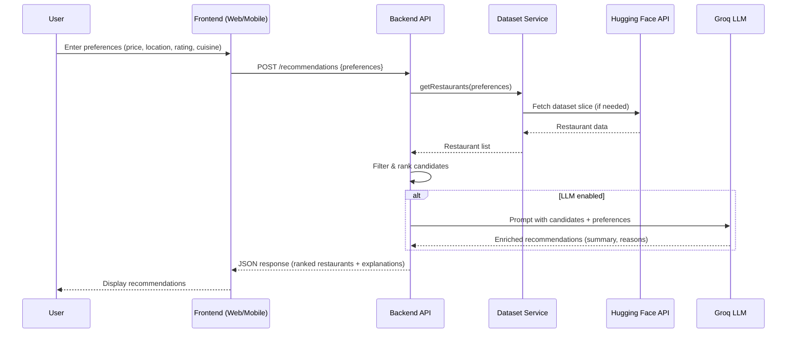

## AI Restaurant Recommendation Service – Architecture

> Note: This document uses Mermaid diagrams. If your viewer does not support Mermaid, you can still follow the adjacent text descriptions, which describe the same architecture in prose.

---

## 1. Project Overview

### 1.1 Purpose
The **AI Restaurant Recommendation Service** helps users find restaurants that best match their preferences by combining **structured filtering** (price, location, rating, cuisine) with an **LLM-enhanced recommendation layer** powered by Groq and restaurant data from a Hugging Face dataset.

### 1.2 Target Users
- **End users**: People looking for restaurant suggestions tailored to:
  - Budget (price range)
  - Location or area
  - Minimum rating
  - Preferred cuisines
- **Product teams / developers**: Who may embed this recommendation API into:
  - Food discovery apps
  - Travel planners
  - City guide services
  - Chatbots/virtual assistants

### 1.3 Core Features
- **Preference-based search**:
  - Filter by price range, location, rating, cuisine.
- **Data-backed results**:
  - Use `ManikaSaini/zomato-restaurant-recommendation` dataset via **Hugging Face API** as the primary data source.
- **LLM-enhanced recommendations**:
  - Summarize, explain, and refine restaurant lists using **Groq LLM**.
- **User-friendly output**:
  - Clear, ranked restaurant list with explanation text and key attributes.
- **(Optional/Future) Personalization**:
  - Learn from previous user selections and feedback.

### 1.4 Example User Journey
1. User opens the web app.
2. User selects:
   - Price range: `₹₹` (mid-range)
   - Location: `Koramangala, Bangalore`
   - Minimum rating: `4.0+`
   - Cuisine: `Italian`
3. User clicks **“Get Recommendations”**.
4. Frontend calls backend API with these preferences.
5. Backend:
   - Fetches/retrieves relevant restaurant data from the dataset.
   - Filters by preferences.
   - Ranks resulting candidates.
   - Calls **Groq LLM** with:
     - Filtered restaurants
     - User preferences
     - A specific system prompt to produce a readable, concise recommendation list.
6. API returns:
   - Top 5–10 restaurants with:
     - Name, rating, price level, cuisine, location, key highlights.
     - Short explanation for why each is recommended.
7. UI displays recommendations and possibly a “Refine” or “Show more like this” option.

---

## 2. Tech Stack Recommendation

### 2.1 Frontend
- **Recommended**: **Next.js (React-based)**
- **Justification**:
  - SEO-friendly if web discovery matters.
  - Good developer experience; server components if needed.
  - Easy integration with API endpoints and static pages.
- **Alternative**: React SPA with Vite or CRA (if SEO is less important).

### 2.2 Backend
- **Recommended**: **Python + FastAPI**
- **Justification**:
  - Excellent for building **data-heavy, ML/AI-adjacent APIs**.
  - Async support for calling Hugging Face and Groq.
  - Fast, minimal boilerplate, auto-generated docs (OpenAPI/Swagger).
- **Alternatives**:
  - Node.js (Express/NestJS) – if team is JS-focused.
  - Spring Boot – more enterprise-heavy, good if org standard is Java.

### 2.3 Mobile (Future Phase)
- **React Native**
  - Can reuse UI patterns and logic from React/Next.js.
  - Mobile app calls the same backend API endpoints.

### 2.4 LLM Provider
- **Groq**
  - Use Groq’s hosted API for fast LLM inference.
  - Backend will:
    - Prepare structured prompt.
    - Call Groq with restaurant candidates + preferences.
    - Parse and return results.

### 2.5 Dataset Source
- **Hugging Face Dataset API**
  - Dataset: `ManikaSaini/zomato-restaurant-recommendation`
  - Access pattern:
    - **Online/On-demand**:
      - Backend calls Hugging Face API per request.

### 2.6 Database (If Needed)
- **Phase 1–2 (MVP)**:
  - Run **without a DB** – talk directly to the Hugging Face dataset API.
- **Phase 3+ (Optional/Future)**:
  - **Option**: PostgreSQL
    - Store restaurant data locally for faster querying.
    - Maintain user profiles, favorites, and feedback.

### 2.7 Hosting / Cloud
- **Backend**:
  - Deploy on **Render**, **Railway**, **AWS (Lambda/ECS)**, **GCP Cloud Run**, or **Azure App Service**.
  - Prefer container-based deployment (Docker).
- **Frontend**:
  - Next.js app on **Vercel**, **Netlify**, or same cloud provider as backend.
- **Secrets & Config**:
  - Store API keys (Groq, Hugging Face) in environment variables or secrets manager.

---

## 3. High-Level System Architecture

### 3.1 Components
- **Frontend Client**:
  - Collects user preferences.
  - Calls backend recommendation API.
  - Renders recommendations.
- **Backend API (FastAPI)**:
  - Exposes endpoints (`/recommendations`, `/health`, etc.).
  - Orchestrates services.
- **Dataset Integration Service**:
  - Handles communication with Hugging Face dataset API.
  - Fetches restaurant data on-demand.
- **Recommendation Engine**:
  - Core logic: filtering, scoring, ranking.
- **Groq LLM Service**:
  - Prepares prompts and calls Groq.
  - Returns enriched recommendation text.
- **Optional Database** (future):
  - Stores restaurant data and user interaction history.

### 3.2 High-Level Architecture Diagram (Mermaid)

```mermaid
flowchart LR
    User -->|preferences| Frontend[Web / Mobile Client]

    Frontend -->|REST API| Backend[Backend API (FastAPI)]
    
    subgraph Backend Services
        Backend --> RecEngine[Recommendation Engine]
        RecEngine --> DatasetSvc[Dataset Integration Service]
        RecEngine --> LLMService[Groq LLM Service]
        DatasetSvc -->|fetch| HFAPI[Hugging Face Dataset API]
        LLMService --> GroqLLM[Groq LLM API]
    end

    Backend -->|recommendations JSON| Frontend
    Frontend -->|display list & explanations| User
```

### 3.3 Alternative Text Diagram (If Mermaid Not Supported)

**Text-based architecture view:**

- **User**
  - interacts with
    - **Frontend (Web/Mobile client)**
      - sends REST request to
        - **Backend API (FastAPI)**
          - orchestrates:
            - **Recommendation Engine**
              - calls **Dataset Integration Service**
                - which fetches data from **Hugging Face Dataset API**
              - calls **Groq LLM Service**
                - which sends prompts to **Groq LLM API**
          - returns recommendations JSON back to **Frontend**
      - renders restaurant recommendations for **User**

---

## 4. Detailed Backend Architecture

### 4.1 API Endpoints (MVP)

- **`GET /health`**
  - **Purpose**: Health check.
  - **Response (200)**:
    ```json
    { "status": "ok" }
    ```

- **`POST /recommendations`**
  - **Purpose**: Get restaurant recommendations based on preferences.
  - **Request Body** (example):
    ```json
    {
      "location": "Koramangala, Bangalore",
      "price_range": "mid",
      "min_rating": 4.0,
      "cuisines": ["Italian", "Pizza"],
      "limit": 10,
      "use_llm": true
    }
    ```
  - **Response Body** (example):
    ```json
    {
      "query": {
        "location": "Koramangala, Bangalore",
        "price_range": "mid",
        "min_rating": 4.0,
        "cuisines": ["Italian", "Pizza"]
      },
      "results": [
        {
          "name": "La Pizzeria",
          "location": "Koramangala 5th Block",
          "rating": 4.5,
          "price_level": "mid",
          "cuisines": ["Italian", "Pizza"],
          "highlights": ["Stone-baked pizzas", "Cozy ambience"],
          "reason": "Best match for mid-budget Italian near Koramangala with high rating."
        }
      ],
      "llm_summary": "Here are the best mid-budget Italian options near Koramangala ..."
    }
    ```

- **(Future) `POST /feedback`**
  - Store user feedback about a recommendation (like/dislike, visited).

### 4.2 Service Layer Separation

- **Controller Layer (FastAPI routers)**
  - `recommendations_router`:
    - Validates requests.
    - Calls `RecommendationService`.
    - Handles HTTP-specific concerns (status codes, error mapping).

- **RecommendationService**
  - High-level orchestration:
    1. Normalize and validate preferences.
    2. Fetch dataset slice via `DatasetService`.
    3. Filter and rank restaurants.
    4. If `use_llm`:
       - Call `LLMService` with list of candidate restaurants + user context.
       - Merge LLM-generated explanations into response.

- **DatasetService**
  - Encapsulates interaction with:
    - Hugging Face dataset API.
  - Responsibilities:
    - Build query parameters.
    - Handle pagination or dataset slicing.
    - Translate raw dataset schema into internal `Restaurant` model.

- **LLMService**
  - Manages:
    - Prompt templates.
    - LLM API calls (Groq).
    - Response parsing and safety (e.g., truncation, format checks).

- **Persistence Layer (optional/future)**
  - Repository classes if a database is introduced later:
    - `RestaurantRepository`.
    - `FeedbackRepository`.

### 4.3 LLM Prompt Pipeline (Groq)

1. **Input Construction**
   - Take:
     - User preferences.
     - Top N candidate restaurants (already filtered and ranked).
   - Transform into:
     - Short, structured overview of preferences.
     - Structured list of restaurants (name, rating, price, cuisine, highlights).

2. **Prompt Template**
   - **System prompt**:
     - Defines role (e.g., “You are a helpful restaurant recommendations assistant...”).
   - **User prompt**:
     - Includes preferences and restaurant list.
     - Asks for:
       - A ranked subset.
       - Explanations per restaurant.
       - Brief overall summary.

3. **Groq API Call**
   - Send structured prompt to Groq LLM endpoint.
   - Define max tokens, temperature (e.g., 0.3–0.7), etc.

4. **Post-processing**
   - Parse generated text (prefer structured formats like JSON if feasible).
   - Attach:
     - LLM explanations to each restaurant.
     - Overall `llm_summary`.

### 4.4 Dataset Ingestion and Filtering Logic

- **Ingestion Mode (current scope)**:
  - **On-demand only**:
    - For each request, `DatasetService` makes a query to Hugging Face.

- **Data Normalization (on ingest or sync)**:
  - **Price**:
    - Store price as a **numeric value without formatting**, e.g. `1500` instead of `"1,500"` or `"₹1,500"`.
    - Strip currency symbols and thousands separators and convert to an integer or decimal column (e.g., `price_in_minor_units` or `average_cost_for_two`).
  - **Rating**:
    - Store rating as a **numeric value** (e.g., `4.1`), not a string like `"4.1/5"`.
    - If the raw data is `"4.1/5"`, parse out the numeric part and keep it in a `rating` float column.
  - **Cuisines**:
    - Normalize cuisines into a **list/array of clean strings**:
      - Split on commas from raw strings like `"North Indian, Chinese"`.
      - Trim whitespace and standardize casing (e.g., Title Case or lowercase).
      - Optionally maintain a mapping table to unify variants (e.g., `"south indian"` and `"South-Indian"` → `"South Indian"`).
  - **Duplicate identity fields**:
    - Define a unique identity key for restaurants, e.g. `restaurant_id` from the dataset, or a composite key like `(name, full_address)`.
    - On ingest, remove or merge duplicate entries based on this key so that the internal store has **no duplicate restaurants**.

- **Filtering Steps** (in `RecommendationService`):
  1. **Location Matching**:
     - Match `location` string to dataset fields (city/area).
     - Allow partial matches and fallbacks (e.g., city-wide if area not found).
  2. **Price Range**:
     - Map user-friendly values (`low`, `mid`, `high`) to numeric or categorical dataset fields.
  3. **Rating Filter**:
     - Keep restaurants with rating ≥ `min_rating`.
  4. **Cuisine Filtering**:
     - Match any of the requested cuisines (case-insensitive).
  5. **Duplicate Removal (defensive)**:
     - Even though duplicates should be eliminated at ingest, apply a final **deduplication step** on the filtered set:
       - Use the unique restaurant key (`restaurant_id` or `(name, full_address)`) to drop any duplicates that slipped through.
       - Prefer keeping the entry with the most complete or latest data.
  6. **Result Limiting**:
     - Keep top K unique candidates (e.g., 30) to pass to ranking + LLM.

### 4.5 Error Handling and Validation

- **Input Validation**:
  - Ensure:
    - `location` is non-empty.
    - `price_range` is one of allowed values or valid numeric range.
    - `min_rating` is between 0 and 5.
    - `cuisines` is a list of non-empty strings.
  - Return 400 with clear error messages on invalid input.

- **External Errors (Hugging Face / Groq)**:
  - Timeouts and network errors:
    - Log error.
    - Return 502/503 with user-friendly message.
  - Rate limits:
    - Detect and respond with retriable error.

- **Fallback Behavior**:
  - If LLM call fails:
    - Still return filtered & ranked list without LLM explanations.
    - Add a field like `"llm_used": false`.

---

## 5. Recommendation Logic

### 5.1 Processing User Preferences

1. **Normalization**:
   - Trim whitespace, lowercase strings where needed.
   - Map user-facing values:
     - `price_range`: map `low` → internal numeric band (e.g., 1–2), `mid` → 2–3.
    - Ensure numeric inputs are parsed correctly:
      - Convert price-related inputs to **plain numbers** (e.g., `"1,500"` → `1500`).
      - Validate/parse ratings as **floats** (e.g., `"4.1"` or `"4.1/5"` → `4.1`).
    - Normalize cuisines:
      - Split comma-separated strings into lists.
      - Trim and standardize casing so `"north indian, CHINESE"` becomes `["North Indian", "Chinese"]`.
   - Handle missing values:
     - If `cuisines` not provided, don’t filter by cuisine.
     - If `min_rating` not provided, use default (e.g., 3.5).

2. **Geo/Location Handling** (simple version):
   - Exact or partial match on area/city fields.
   - Future improvement: geocoding, distance-based filter.

### 5.2 Filtering Strategy

- **Step 1**: Pre-filter on location.
- **Step 2**: Filter by `price_range`.
- **Step 3**: Filter by `min_rating`.
- **Step 4**: Filter by cuisine:
  - Keep restaurants where at least one cuisine matches user’s list.
- **Step 5**: If too few results:
  - Relax constraints:
    - Widen area (e.g., entire city).
    - Slightly lower rating threshold.

### 5.3 Ranking Logic

- **Composite Scoring** (conceptual):
  - Example score formula:
    - `score = w_r * rating + w_p * price_fit + w_c * cuisine_match + w_l * location_match`
  - **rating**: normalized 0–1 from dataset rating.
  - **price_fit**:
    - Higher if restaurant’s price level matches user range.
  - **cuisine_match**:
    - 1.0 if multiple cuisines match, 0.5 if only one.
  - **location_match**:
    - 1.0 for exact area match; 0.7 for same city, different area.

- **Sorting**:
  - Sort candidates by descending `score`.
  - Choose top N (e.g., 10) to return and maybe top M (e.g., 20–30) as input to LLM for richer reasoning.

### 5.4 How Groq LLM Improves Recommendations

- **Human-readable explanations**:
  - Transforms numeric and categorical attributes into:
    - “Great for date nights but still affordable.”
- **Contextual ranking**:
  - If many restaurants are similar, LLM can:
    - Suggest varied options:
      - “Best for large groups.”
      - “Cozy, romantic spot.”
- **Conflict resolution**:
  - Handles trade-offs (e.g., slightly above budget but much higher rating).
- **Refinement and personalization (future)**:
  - Incorporate past feedback:
    - “You liked spicy food before, so I highlighted these options.”

### 5.5 Example Prompt Sent to Groq

```text
System:
You are a helpful restaurant recommendation assistant.
You must only recommend restaurants from the list provided.
You optimize for the user's preferences: location, price range, rating, and cuisine.
Explain your choices clearly and concisely.

User:
The user is looking for restaurants with the following preferences:
- Location: Koramangala, Bangalore
- Price range: mid-budget
- Minimum rating: 4.0
- Preferred cuisines: Italian, Pizza

Here is a list of candidate restaurants (JSON):
[ ... list of 20 candidate restaurants with name, rating, price_range, cuisines, location, highlights ... ]

Tasks:
1. Select the 5 best restaurants that match the preferences.
2. For each restaurant, provide:
   - A one-sentence reason why it is a good match.
   - Any standout features (e.g., ambience, specialties).
3. Provide a short overall summary (2–3 sentences) explaining how you chose them.

Output your answer as a JSON object with:
{
  "summary": "...",
  "restaurants": [
    {
      "name": "...",
      "reason": "...",
      "highlights": ["...", "..."]
    }
  ]
}
```

---

## 6. Data Flow

### 6.1 Step-by-Step Flow

1. **User → Frontend**
   - User fills in:
     - Location / place
     - Price range
     - Rating
     - Cuisine(s)
   - Clicks **“Get Recommendations”**.

2. **Frontend → Backend**
   - Frontend sends `POST /recommendations` request with JSON body containing preferences.

3. **Backend → Dataset**
   - `RecommendationService` calls `DatasetService`.
   - `DatasetService`:
     - Queries Hugging Face dataset API or local DB/cache.
     - Returns a list of restaurants.

4. **Backend: Filtering & Ranking**
   - `RecommendationService`:
     - Applies filters (location, price, rating, cuisine).
     - Computes score for each candidate.
     - Selects top N restaurants.

5. **Backend → Groq LLM**
   - If `use_llm == true`:
     - `LLMService` builds structured prompt with:
       - User preferences.
       - Top candidates.
     - Sends to Groq LLM.
     - Receives enriched recommendations (explanations, final ranking).

6. **Backend → Frontend**
   - Backend consolidates:
     - Structured restaurant data.
     - LLM explanations and summary (if available).
   - Returns final JSON response.

7. **Frontend → User**
   - Frontend renders:
     - List of recommended restaurants.
     - Explanations and key details.
   - User can refine or give feedback (future).

### 6.2 Data Flow Diagram (Mermaid)



---

## 7. Phased Development Plan

### Phase 1 – Core MVP (Backend + Simple Frontend)

- **Goals**:
  - Implement core API and simple UI.
  - Support basic preference input and recommendations.
- **Tasks**:
  - Set up project structure (FastAPI backend, Next.js or simple React frontend).
  - Implement:
    - `POST /recommendations`
    - `GET /health`
  - Integrate with Hugging Face dataset API (minimal on-demand fetching).
  - Implement basic filtering logic (location, price range, rating, cuisine).
  - Implement simple ranking (rating + basic price fit).
  - Build basic web form:
    - Input fields for preferences.
    - Display tabular list of recommended restaurants.
- **Outcome**:
  - Users can get structured recommendations **without LLM enhancement**.

### Phase 2 – Groq LLM Integration

- **Goals**:
  - Enhance recommendations and explanations with Groq LLM.
- **Tasks**:
  - Implement `LLMService`:
    - Prompt templates.
    - Groq API calls.
    - Response parsing (prefer JSON output format).
  - Integrate LLM call in `RecommendationService` (behind `use_llm` flag).
  - Update API response structure to include:
    - `llm_summary`
    - Per-restaurant `reason`/`highlights` from LLM.
  - Add UI enhancements:
    - Show explanations and summaries.
    - Indicate when AI enhancement is used.
- **Outcome**:
  - Users receive more insightful and human-friendly recommendations.

### Phase 3 – Performance, Caching, and Data Management

- **Goals**:
  - Improve performance and reliability.
- **Tasks**:
  - Introduce **local caching** for:
    - Hugging Face dataset slices.
    - Repeated LLM responses (for identical queries).
  - Optionally introduce a **database** (PostgreSQL):
    - Store restaurant data locally for faster querying.
    - Run periodic sync jobs from Hugging Face.
  - Add **Redis** (optional) for:
    - Caching popular query results.
  - Implement:
    - Robust error handling.
    - Observability (logging, metrics, tracing basics).
- **Outcome**:
  - Faster, more reliable service under heavier usage.

### Phase 4 – Rich Web UI, Personalization, and Mobile

- **Goals**:
  - Deliver a richer, production-ready **Web UI**, personalize results, and expand to mobile.
- **Tasks**:
  - Upgrade the web experience from a basic form to a **full Web UI**:
    - Modern, responsive Next.js UI with clear layout and visual hierarchy.
    - Rich results view (cards, sorting, filtering, map section – optional).
    - Loading states, error states, and empty-state UX.
    - “Refine search” and “similar restaurants” interactions.
  - Implement `/feedback` endpoint to capture:
    - Likes/dislikes, “visited”, etc.
  - Extend DB schema with:
    - User profiles
    - Preference history
  - Adjust recommendation logic:
    - Incorporate user history and feedback into scoring.
  - Develop **React Native** app:
    - Reuse core UI patterns.
    - Integrate with existing API.
- **Outcome**:
  - A polished Web UI plus personalization and multi-platform access.

### Phase 5 – Frontend UI (Modern Web Interface)

- **Goals**:
  - Build a **modular, modern, and responsive** web interface that connects to the Phase 4 backend API.
  - Provide an intuitive way for users to input preferences and view restaurant recommendations.

- **Tech Stack**:
  - **HTML5 + CSS3 + Vanilla JavaScript** (no heavy frameworks – keeps it simple and modular).
  - Responsive design using CSS Grid / Flexbox and media queries.
  - Communicates with the backend via `fetch()` calls to `http://localhost:8004/api/`.

- **UI Components** (modular structure):
  - **Header / Navigation Bar**:
    - App title/logo and optional dark/light mode toggle.
  - **Filter Panel**:
    - **Location**: Text input with placeholder (e.g., "Bangalore").
    - **Price Range**: Dropdown or button group (`Low`, `Mid`, `High`).
    - **Minimum Rating**: Slider or number input (0–5 scale).
    - **Cuisine**: Text input or dropdown with common options (e.g., Italian, Chinese, North Indian).
    - **"Get Recommendations"** button to submit the form.
  - **Results Section**:
    - Displays restaurant recommendation cards in a responsive grid.
    - Each card shows: **Name**, **Location**, **Rating** (star display), **Price**, **Cuisine**, and **Reason** (from the API).
    - If LLM summary is available (`llm_used: true`), display it as a highlighted summary block above the cards.
  - **Feedback Interaction**:
    - Each restaurant card includes a **Like / Dislike** button.
    - Clicking sends a `POST /api/feedback` request to store user preference.
  - **Loading & Empty States**:
    - Show a spinner/skeleton while waiting for API response.
    - Display a friendly message when no results are found.
  - **Error Handling**:
    - Show user-friendly error messages if the backend is unreachable or returns an error.

- **Responsive Design**:
  - **Desktop**: Filters on the left sidebar/top bar, results in a multi-column grid.
  - **Tablet**: Filters collapse above results, 2-column grid.
  - **Mobile**: Full-width stacked layout, filters as a collapsible section.

- **File Structure**:
  ```
  phase5/
  └── frontend/
      ├── index.html          # Main HTML page
      ├── css/
      │   └── styles.css      # All styling (responsive, modern design)
      └── js/
          ├── app.js           # Main app logic, initialization
          ├── api.js           # API calls (recommendations, feedback)
          └── ui.js            # DOM manipulation, rendering cards
  ```

- **Design Principles**:
  - **Modern aesthetics**: Clean typography (Google Fonts), vibrant color palette, subtle shadows and rounded corners.
  - **Micro-animations**: Smooth transitions on card hover, button clicks, and loading states.
  - **Accessibility**: Proper labels, contrast ratios, keyboard navigation support.

- **Outcome**:
  - Users can interact with the recommendation system through a polished web interface.
  - The frontend is fully decoupled from the backend — connects via REST API calls.
  - Modular JS files make it easy to extend or refactor later.

### Phase 6 – Admin Dashboard

- **Ideas**:
  - **Admin dashboard**:
    - See popular queries, top recommended restaurants, error rates.

### Phase 7 – Advanced Features (Optional)

- **Ideas**:
  - **Geo-based search**:
    - Use real coordinates and distance-based filtering.
  - **Multi-LLM support**:
    - Fallback to other models/providers if Groq is unavailable.
  - **A/B testing**:
    - Experiment with different ranking strategies and prompts.

